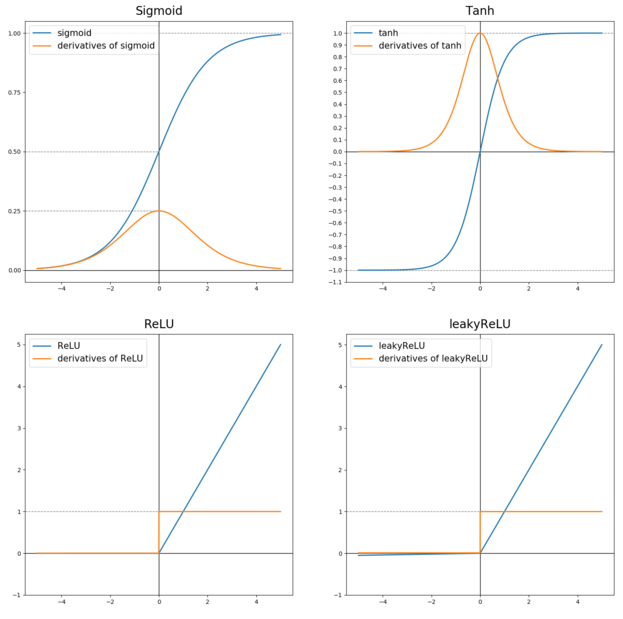
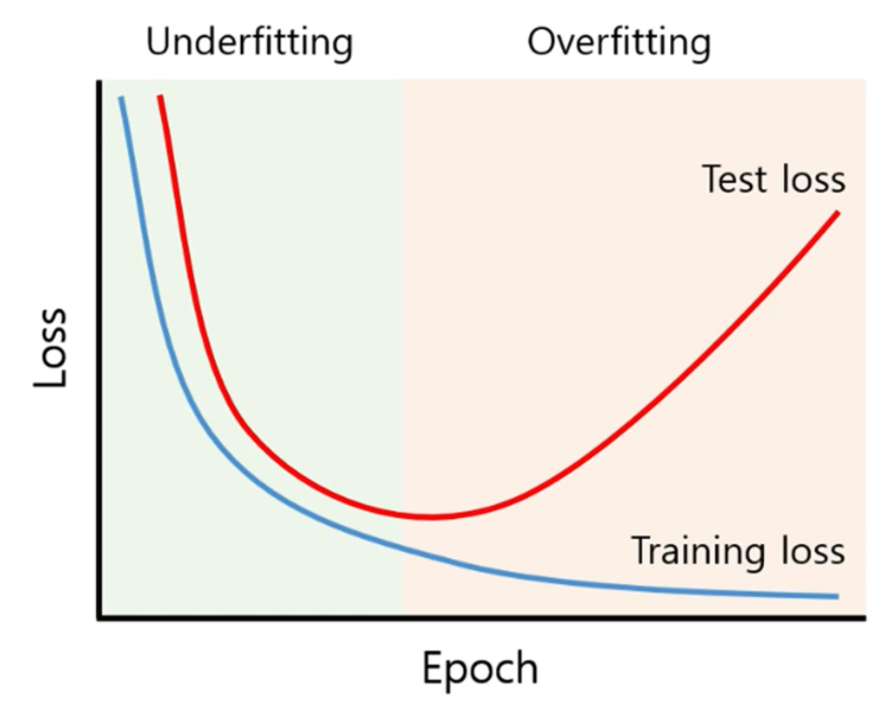
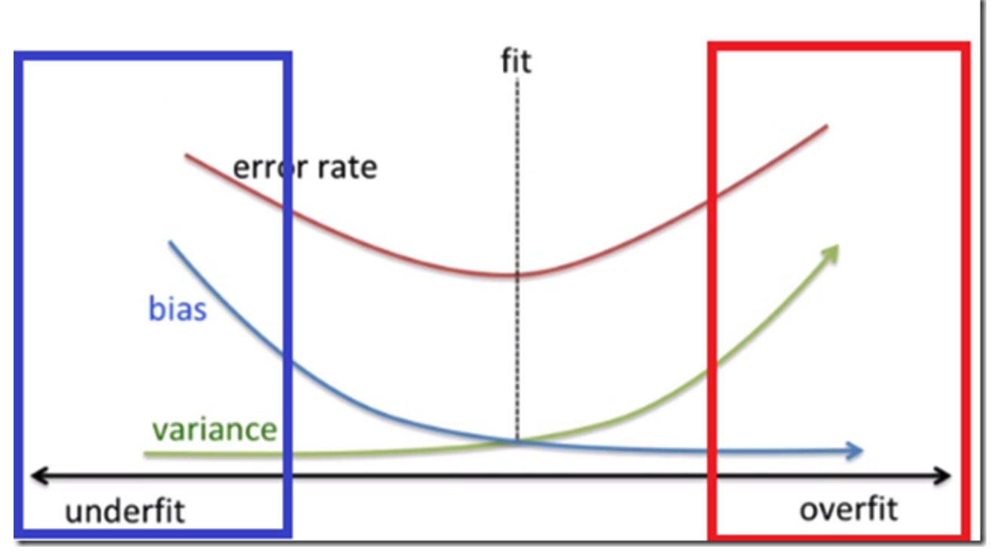
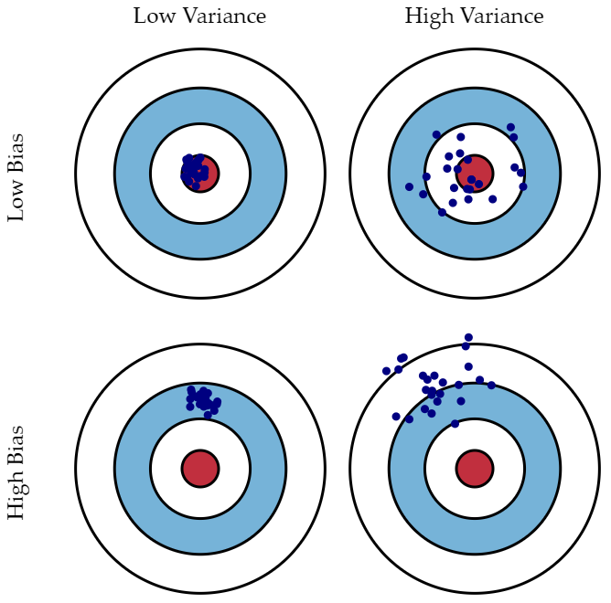

## **면접 대비용 Cheet Sheet - 정리편**

---

### 퍼셉트론과 신경망

- 가중치(weight): 이전 노드 신호의 영향력을 제어
- 편향(bias): 뉴런이 얼마나 쉽게 활성화되는지 제어

> 퍼셉트론은 사람이 파라미터를 직접! 설정!하는 것  
> 기계학습은 컴퓨터가 파라미터를 학습!하는 것  

- 학습: 적절한 파라미터를 찾는 것, 훈련데이터로부터 가중치 파라미터의 최적값을 자동으로 획득하는 것
- 은닉층(hidden layer): 입력층과 출력층을 제외한 레이어(보이지 않음)
- N층 신경망: N+1개의 레이어로 이루어져있으나, 맨 앞의 입력층은 학습가능한 가중치를 가지지 않으므로 N층 신경망이라 부름

> 퍼셉트론과 신경망은 조금 다르다!

### 활성화 함수와 순전파

- 활성화 함수(activation function): 입력 신호의 총합을 출력신호로 변환
- 활성화함수에는 비선형함수만 사용한다. 선형함수를 사용하면 신경망의 층을 깊게 쌓는 의미가 없기 때문이다.
- 비선형 함수로서, 모델을 복잡하게 하여 성능을 높일 수 있음
- 활성화함수의 문제: saturation 현상 - 뒤쪽의 레이어가 saturation되면 앞의 모든 레이어들도 saturation되어 w의 업데이트가 중단된다. (chain rule). 접선의 기울기가 0이되는 곳이 saturation되는 지점으로, w의 업데이트량이 0인 지점 -> 이 현상을 포함해서 w의 업데이트가 0이 되는 현상을 모두 일컫어 vanishing gradient라고 함
- 종류
  - Step function
  - Sigmoid
  - ReLU
  - tanh
  - Leaky ReLU
  - ELU
  - maxout

- 문제에 따른 활성화함수
  - 회귀에는 항등함수(입력을 그대로 사용)
  - 이진분류에는 sigmoid
  - 다중클래스 분류에는 소프트맥스(총합이 1이므로 확률로 해석할 수 있음)를 사용
- `step function` vs. `sigmoid function`
  - 계단함수는 0 혹은 1을 출력으로 삼으며, 퍼셉트론에 사용된다.
  - 시그모이드 함수는 연속적인 실수를 출력으로 삼으며, 신경망에 사용된다.
- 시그모이드 함수의 특징
  - 0과 1사이의 값만 가질 수 있도록하는 비선형 함수
  - 하지만, 보통 Sigmoid Function은 이진 분류(0, 1) 출력을 가지는 출력층에서만 사용된다.
  - 보통 은닉층에서는 사용하지 않는다.
  - 분류 문제에서 추론(inference) 과정에서는 출력층의 소프트맥스를 거치지 않는다. 그 이유는 소프트맥스를 거쳐도 가장 큰 노드, 클래스는 똑같기 때문이다. (단조증가 함수이므로) 대신 여기서의 소프트맥스 함수는 학습(Train)과정에서만 사용된다.
  - 마지막층의 sigmoid는 사실상 output function, squarch function이다. input이 무엇이 들어가던 0~1 사이의 값이 나도도록 squarshing하여, classification이 가능케한다
  - activation function으로서의 장점은 없다.
- tanh 함수의 특징
  - 이 함수는 -1 ~ 1 사이의 값을 가질 수 있도록 하는 비선형 함수이다.
  - 수학적으로는 0 ~ 1 사이의 값을 갖는 Sigmoid Function을 평행이동한 것과 동일하다.
  - 데이터 중심을 0으로 위치시키는 효과가 있기 때문에, 다음 층의 학습이 더 쉽게 이루어진다.
  - 따라서, 보통 Sigmoid Function보다 더 좋은 성능을 발휘한다.
  - 출력의 중심이 0에 있다는 장점이 존재합니다. 이는 시그모이드 함수의 단점 중 출력의 중심이 0이 아니라 발생하는 문제점을 보완
- ReLU 함수의 특징
  - 이 함수는 x 가 양수면 미분값이 1이고, x 가 음수면 미분값이 0인 함수이다.
  - Gradient Vanishing 문제(layer가 늘어날때 값이 사라지는 현상)가 해결되기 떄문에, 가장 기본적인 활성화 함수로 사용된다.
  - ReLU 의 한 가지 단점은, x 가 음수일 때 미분값이 0이라는 것이지만, 실제로는 잘 작동한다.
  - 하지만 다른 버전의 ReLU 가 있는데, 바로 leaky ReLU
- leaky ReLU
  - 음수일 때 미분값이 0이 되는 RELU Function 대신, 약간의 기울기를 갖는 함수이다.
  - 대개는 ReLU 활성함수 보다 잘 작동하지만 실제로는 잘 사용하지는 않는다.
- maxout
  - saturation 현상과 zigzag 현상을 커버하는 유일한 activation func
  - 두개의 선형연산이기 때문에 saturate 하지 않음
  - 언제나 꽤 좋은 성능을 보장
  - weight가 두배이므로 연산도 두배!
- `sigmoid function`와 `tanh function`의 단점
  - x 가 매우 크거나 매우 작을 때, 함수의 Gradient(미분값,기울기)가 거의 0이 된다.
    - = Gradient Vanishing 문제가 발생
    - Sigmoid Function의 도함수를 살펴보면 최대값이 0.25
    - 여러 층을 쌓으면서 역전파 시, 미분값이 중첩되므로, 결국 레이어가 깊어질수록 Gradient 값이 급격히 줄어들게 된다.
    - 이를 해결하기 위해 RELU Function을 사용

> 기계학습 문제  
> - 회귀문제: 입력데이터에 대해서 연속적인 수치를 예측하는 문제  
> - 분류문제: 데이터가 어느 클래스에 속하느냐의 문제   

- 원-핫 인코딩: 하나의 원소만 1이고 나머지는 0인 배열로 나타내는 것
- 정규화(normalization): 데이터를 특정 범위로 변환하는 처리
- 전처리(pre-processing): 신경망의 입력데이터에 특정 변환을 가하는 것

> 그냥 전체의 합으로 나눠주는 정규화를 할 수도 있지만, 현업에서는 데이터 전체의 분포를 고려하여 전처리 하는 경우가 많음. 예를들어 데이터의 평균과 표준편차를 이용하여 데이터들이 0을 중심으로 분포하게 이동시키거나 데이터의 확산 범위를 제한하기도 함

- 백색화(whitening): 전체 데이터를 균일하게 분포시킴
- 배치(batch): 하나로 묶은 입력 데이터

### 신경망 학습

- 신경망 학습의 목표: 손실함수의 결과값을 가장 작게 만드는 가중치 매개변수를 찾는 것
- 경사법: 손실함수의 결과값을 작게하기 위한 기법
- 이미지에서 특징(feature)를 추출하고 그 특징의 패턴을 기계학습 기술로 학습하는 방법
  - 특징: 입력데이터에서 중요한 데이터를 추출할 수 있도록 설계된 변환기
  - (참고)이미지의 특징추출 알고리즘
    - SIFT, SIRF, HOG
    - 이미지 데이터를 벡터로 변환
  - 벡터를 가지고 지도학습의 대표적 분류 기법인 SVM, KNN(기계학습)등으로 학습 가능
- end-to-end 기계학습(=딥러닝)
  - 입력데이터에서 출력데이터를 얻음(사람의 개입없이)

#### 학습 데이터셋, 테스트 데이터셋

- 훈련데이터만 사용하여 학습하면서 최적의 파라미터를 찾고, 시험데이터를 사용하여 앞서 훈련한 모델의 정확도를 평가한다.
- 범용 능력을 위해서 데이터셋을 두 분류(train data, test data)로 나누게 된다. 범용능력이란 아직 보지 못한 데이터로도 문제를 올바르게 풀어내는 능력이다.

  

- 오버피팅(over fitting): 하나의 데이터셋에만 지나치게 최적화된 상태
  - 문제: 학습데이터셋에서의 정확도는 높으나, 테스트데이터셋에 대한 정확도가 낮음, 높은 분산
  - 원인: 너무 많은 특징을 가짐, 큰 에폭
  - 해결책
    - 충분히 많은 학습 데이터 사용(혹은 데이터를 조금씩 늘려가면서 레이어를 늘린다 ex 64-> 128 -> 512...)
    - 피쳐의 수를 줄이기(drop out)
    - augmentation을 통해서 다양한 케이스를 확보
    - lr 높여서 정규화를 이용
    - 교차검증
    - early stopping: 에폭 이전에 비해서 오차 증가하면 학습 종료
    - cost function 변형
- 언더피팅(under fitting): 모델링 대상을 설명하기에 필요한 정보를 충분히 모델에 반영하지 못한 상태
  - 문제: 학습데이터에 대한 정확도도 낮고, 테스트 데이터셋에 대한 정확도도 낮음, 높은 편향
  - 원인:너무 적은 데이터셋
  - 해결책
  - 학습셋이 적거나 학습이 제대로 되지 않아, 목적함수와 학습데이터간의 오류가 많은 경우
  - 데이터가 부족한 경우, data augmentation을 이용해서라도 늘린다
  - augmentation: 데이터를 늘려서 모델의 능을 높임(VGG에서 많이 사용)
    - 좌우반전, 이미지 자르기, 밝기 조절
  - 앙상블(ensemble): 데이터를 나누어 여러 모델을 만들어서 나온 결과 중 가장 많이 나온 결과를 선택함(bagging), 마치 여러 모델을 학습시킨 것과 같은 효과
  - 

- 교차검증(Cross Validation): 주어진 일부는 학습을 시켜서 모델을 만드는데 사용하고, 일부는 모델을 검증하는 데에 사용(학습하지 않은 existing data)
- 정규화(Regularization)

##### 편향(bias)과 분산(variance)

  

- 편향(bias)
  - 실제 값에서 멀어진 척도
  - Bias(편향)는 예측값과 실제값의 차이이다.
  - 즉, Bias(편향)가 크다는 것은, 예측값과 실제값의 차이가 크다는 것이며, 이는 과소적합을 의미한다.
- Variance(분산)
  - 예측된 값들이 서로 얼마나 떨어져있는가
  - Variance(분산)는 입력에 따른 예측값의 변동성을 의미한다.
  - 즉, Variance(분산)가 크다는 것은, 입력에 따른 예측값의 변동성이 크다는 것이며, 이는 과대적합을 의미한다.

  - 1번은 정답
  - 2번은 오버피팅
  - 3번은 언더피팅

#### 손실함수

- 손실함수(loss function): 예측한 값과 정답 값의 차이를 나타내는 지표
- 학습: 손실함수를 최소화하는 최적의 파라미터를 탐색
- 손실함수는 예측값과 실제값이 같으면 0이 되는 특성을 갖고 있어야 한다
- 손실함수의 종류
  - 오차제곱합(sum of squares for error, SSE)
  - 교차엔트로피(cross entropy error, CEE)
    - log사용, 낮은확률로 예측해서 맞추거나, 높은 확률로 예측해서 틀리는 경우의 loss가 더 크다.
    - Binary Crossentropy: 이진 분류 문제에 사용
    - Categorical Crossentropy class: (다중 분류 문제)카테고리 분류에 사용. 레이블 클래스가 2개 이상일 경우 사용된다. 보통 softmax 다음에 연계되어 나온다고 하여 softmax 활성화 함수 다음에 나온다고 하여 softmax loss 라고도 불린다.
  - MSE(Mean Squared Error): 예측한 값과 실제 값 사이의 평균 제곱 오차를 정의한다. 공식이 매우 간단하며, 차가 커질수록 제곱 연산으로 인해서 값이 더욱 뚜렷해진다. 그리고 제곱으로 인해서 오차가 양수이든 음수이든 누적 값을 증가시킨다. 연속형 변수를 예측할 때 사용. MSE는 회귀(regression) 용도의 딥러닝 모델을 훈련시킬때 많이 사용되는 손실 함수입니다.
  - MAE(mean absolute error): MAE는 MSE와 거의 비슷합니다. 에러 제곱의 평균이 아니라 에러 절대값의 평균을 구해줍니다. MAE도 회귀 용도의 딥러닝 모델을 훈련시킬때 많이 사용됩니다. 
  - RMSE(Root Mean Squared Error): MSE에 루트(√)를 씌운 것. MSE 값은 오류의 제곱을 구하기 때문에 실제 오류 평균보다 더 커지는 특성이 있어 MSE에 루트를 씌운 RMSE 은 값의 왜곡을 줄여준다.
  - 코사인유사도
  - KL Divergence
  - 포아송

- 손실함수를 설정하는 이유?
  - 높은 정확도라는 지표대신에 손실함수 값이라는 우회적인 방법을 택하는 이유?
  - 미분
    - 최적의 파라미터를 탐색할 때, 손실함수의 값을 가장 작게 만드는 매개변수를 찾음
    - 이때 미분하여 기울기를 계산하고 그 미분값을 단서로하여 매개변수의 값을 서서히 갱신해가는 과정을 거침
    - 미분값이 음수면 가중치 파라미터를 양의 방향으로 이동시켜서 손실함수의 값을 줄일 수 있음
    - 미분값이 0이면 가중치 매개변수를 어느쪽으로 움직여도 손실함수의 값은 줄어들지 않음
    - 따라서 갱신 멈춤
    - 정확도를 지표로 삼아서 안되는이유: 미분값이 대부분의 장소에서 0이되어, 매개변수를 갱신할 수 없기 때문임
      - 100장 중에서 30장 맞음 -> 가중치 갱신 -> 그래도 100장 중에서 30장 맞음 -> 기울기=0 =>정확도를 0으로 삼으면 안됨
      - 정확도에 비해, 손실함수는 연속적으로 변하기 때문에 사용가능

- 목적함수(Objective Function): 학습을 통해 최적화시키려는 함수. 딥러닝에서는 일반적으로 학습을 통해 Cost를 최소화시키는 optimize 작업을 수행을 하고 이때 Cost function을 Objective function이라 볼 수 있음. 모델(함수)에 대하여 우리가 가장 일반적으로 사용하는 용어로서 최댓값, 최솟값을 구하는 함수를 말합니다. 애초에 cost function과 loss function 모두 비용이 최소화 되는 것을 찾는다고 생각하면 됩니다.결국 loss function은 cost function의 일부이고, cost function는 objective function의 일부라고 보면 되겠습니다.
- 손실함수(Loss Function): input(x)에 대한 예측값(y^)과 실제 label값(y) 사이의 오차를 계산하는 함수. 하나의 input data에 대해서 오차를 계산하는 함수. Loss Function은 single data set을 다룹니다.
- 비용함수(Cost Function): 모든 input dataset에 대해서 오차를 계산하는 함수. Loss Function의 합, 평균 에러를 다룹니다. 즉, single data set이 아니라 entire data set을 다룹니다. 그냥 순간순간의 loss를 판단할 땐 loss function을 사용하고 학습이 완료된 후에는 cost function을 확인하면 될 것 같습니다.
- Objective Function >= Cost Function >= Loss Function

---

- 미니배치(mini-batch) 학습: 데이터의 일부를 추려서 전체의 근사치로서 사용. 전체 데이터의 일부(미니배치)만 골라서 학습을 수행
  - 사용이유? 많은 데이터를 대상으로 한번에 손실함수의 합을 구하기 위해서는 (정규화하여, 평균 손실 함수를 위해서) 시간이 걸리기 때문에
  - 훈련 데이터 중 일부를 무작위로 가져온 선별 데이터를 미니배치라고 한다. 이 미니배치의 손실함수 값을 줄이는 것이 목표
- 배치 정규화(Batch Normalization): 각 미니배치별로 사전  정규화 처리를 수행하는 기법, 다양한 정규화 방법 중 하나는 모델의 복잡가 높아질수록 패널티를 주는 것

- 최적화(Optimization): 비용이 최소화되는 곳이 성능이 가장 잘 나오는 부분이며, 가능한 비용이 적은 부분을 찾는 것

- epoch, batch size, iteration
  1. Epoch
     - 한 번의 epoch는 인공 신경망에서 전체 데이터 셋에 대해 forward pass / backward pass 과정을 거친 것을 말합니다. 즉, 전체 데이터 셋에 대해 한 번 학습을 완료한 상태입니다.
     - 참고로, 신경망에서 사용되는 역전파 알고리즘은 파라미터를 사용하여 입력부터 출력까지의 각 계층의 weight를 계산하는 과정을 거치는 순방향 패스(forward pass), forward pass를 반대로 거슬러 올라가며 다시 한 번 계산 과정을 거쳐 기존의 weight를 수정하는 역방향 패스(backward pass)로 나뉩니다. 이 전체 데이터 셋에 대해 해당 과정(forward pass + backward pass)이 완료되면 한 번의 epoch가 진행됐다고 볼 수 있습니다.역전파 알고리즘이 무엇인지 모른다고 해도 epoch를 전체 데이터 셋에 대해 한 번의 학습 과정이 완료됐다고 이해해도 될 것 같습니다.
     - 즉 epochs = 40이면 전체 데이터를 40번 사용해서 학습을 거친 것입니다. 참고로 epoch 값이 적절한게 중요합니다. 너무 작으면 underfitting, 너무 크면 overfitting이 발생할 확률이 높습니다.
  2. Batch Size, Iteration
     - Batch Size는 한 번의 Batch마다 주는 데이터 샘플의 size를 뜻합니다. 여기서 Batch(보통은 mini-batch라고 표현합니다.)는 나눠진 데이터 셋을 뜻하며 iteration는 epoch를 나누어서 실행하는 횟수라고 생각하면 됩니다.
     - 메모리의 한계와 속도 저하 때문에 대부분의 경우에는 한 번의 epoch에서 모든 데이터를 한꺼번에 집어넣을 수 없습니다. 그래서 데이터를 나누어서 주게 되는데 이 때 몇 번 나눠서 주는가를 iteration, 각 iteration마다 주는 데이터 사이즈를 batch size라고 합니다.

> 정리를 해봅시다. 전체 2000 개의 데이터가 있고, epochs = 20, batch_size = 500이라고 가정합시다. 그렇다면 1 epoch는 각 데이터의 size가 500인 batch가 들어가 네 번의 iteration으로 나누어집니다. 그리고 전체 데이터 셋에 대해서 20번의 학습이 이루어졌으며, iteration 기준으로 본다면 총 80번의 학습이 이루어진 것입니다.

> 편미분: 변수가 여럿인 함수에 대한 미분
> 기울기의 결과에 마이너스를 붙인 벡터를 그려보면, 기울기가 가리키는 방향은 각 장소에서 함수의 출력값을 가장 크게 줄이는 방향이다.

- 학습률(learning rate): 한번의 학습으로 얼마만큼 학습해야할 지, 즉 파라미터 값을 얼마나 갱신하느냐를 정하는 것
- step: 반복횟수
- epoch: 단위, 1 epoch는 학습에서 훈련데이터를 모두 소진했을 때의 횟수에 해당

- 경사하강법(gradient descent): 최솟값을 찾는 것
- 확률적 경사하강법(stochastic gradient descent, SGD): 데이터를 미니배치로 무작위로 선정하여 기울기를 구하고, 기울기 방향으로 파라미터를 갱신하는 과정을 반복하는 경사법 