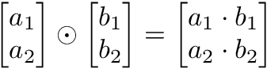

## **[DAY 6] Vector**

---

### **벡터**

- 벡터는 공간에서의 한 점을 나타냄
- 원점으로부터의 상대적 위치를 표현
- 숫자를 원소로 가지는 리스트(list)/배열(array)

- **행벡터**: 1행으로 이루어진 벡터 $X^T$
- **열백터**: 1열로만 이루어진 벡터 $X$
- **벡터의 차원**: 열벡터와 행벡터에서 가장 큰 행, 열의 번호와 같음

- 벡터에 숫자를 곱해주면 길이만 변환(방향은 유지됨)
  - 1보타 크면 늘어나고, 1보다 작으면 줄어듦
  - 단, 0보다 작으면 반대방향이 됨
  - $aX$ : 스칼라곱
  - $a$가 $X$ 배열의 모든 값에 곱해짐
- 벡터끼리 같은 모양을 가지면 덧셈, 뺄셈을 계산할 수 있음

#### **성분곱**(Hadamard product, Element wised product)

- 벡터끼리 같은 모양을 가지는 경우에 가능
- $\odot$ 기호 사용
- 

#### **벡터의 덧셈, 뺄셈**

- 두 벡터의 모양을 중요시 봐야함
- 두 벡터의 모양이 다르면 보통, 계산 불가능

- **덧셈**
  - 두 벡터의 덧셈은 다른 벡터로부터 상대적 위치이동을 표현
- **뺄셈**
  - 뺄셈은 방향을 뒤집은 덧셈임

#### **벡터의 norm 구해보기**

- **벡터의 norm은 원점에서부터의 거리**
- **L1-norm**: 각 성분의 변화량의 절대값을 모두 더함
- **L2-norm**: 피타고라스 정리를 이용하여 유클리드 거리를 계산
  - L2-norm은 `np.linalg.norm`을 이용하여 구현가능
- norm의 종류에 따라 기하학적 성질이 달라지므로, 머신러닝에서는 각 성질들이 필요할 경우가 있으므로 둘 다 사용

##### **두 벡터 사이의 거리**

- L1, L2-norm을 이용하여 두 벡터 사이의 거리를 계산할 수 있음
- 두 벡터 사이의 거리를 계산할 때는 벡터의 뺄셈을 이용함
- 뺄셈을 거꾸로 이용하여도 거리는 같음 
- $\left\vert X-Y \right\vert = \left\vert Y-X \right\vert$

##### **두 벡터 사이의 각도**

- L2-norm인 $\parallel.\parallel_2$만 가능함
- 제2 코사인 법칙에 의해, 두 벡터 사이의 각도를 계산할 수 있음
- 분자를 쉽게 계산하는 방법: 내적

##### **내적**

- 내적은 정사영(orthogonal projection)된 벡터의 길이와 관련이 있음
- 밑변에 생긴 다른변의 그림자의 길이는 코사인법칙에 의해 $\parallel x \parallel cos\theta$가 됨
