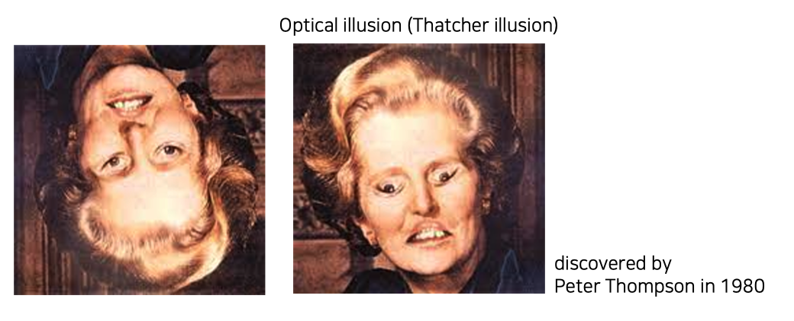
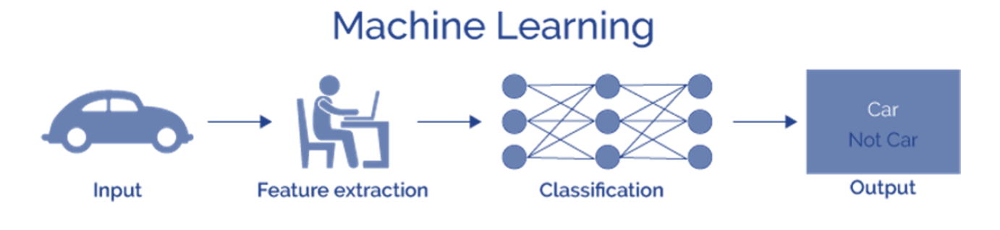
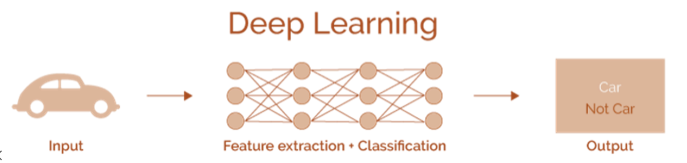
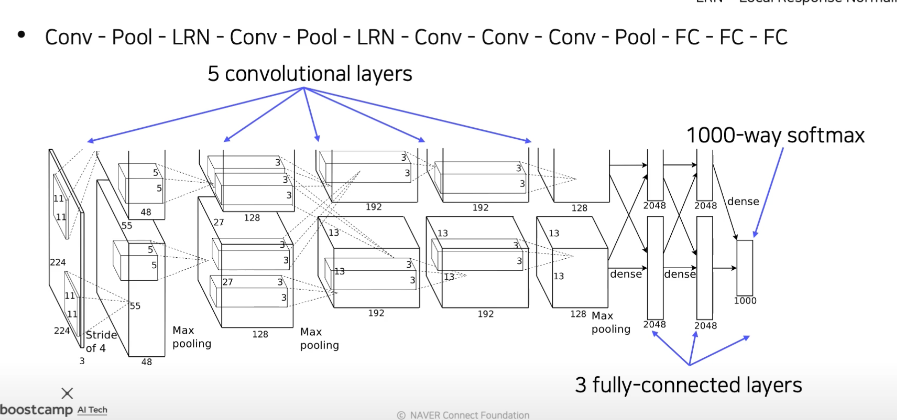
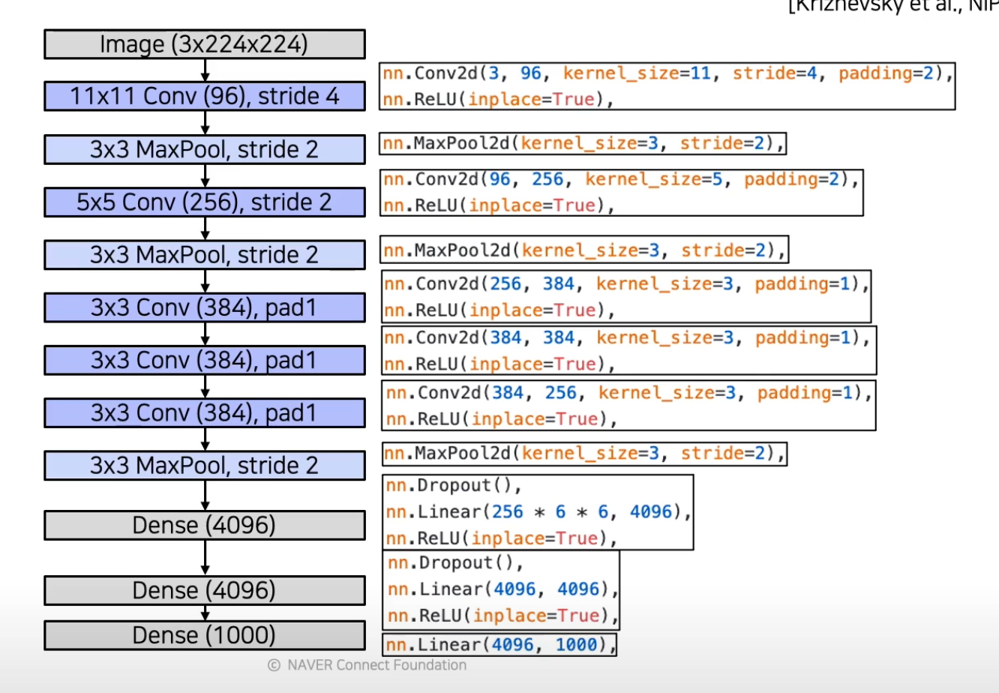
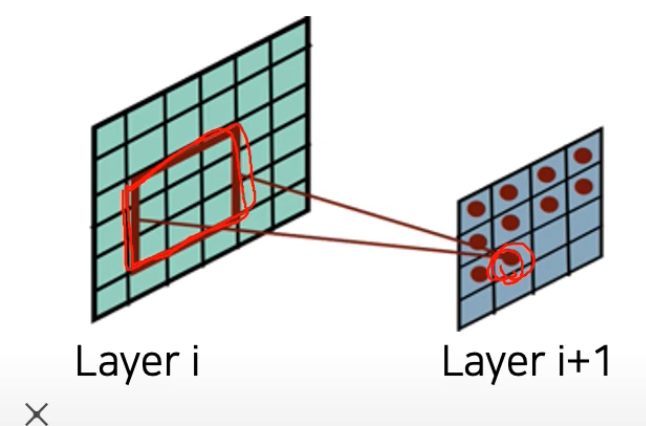
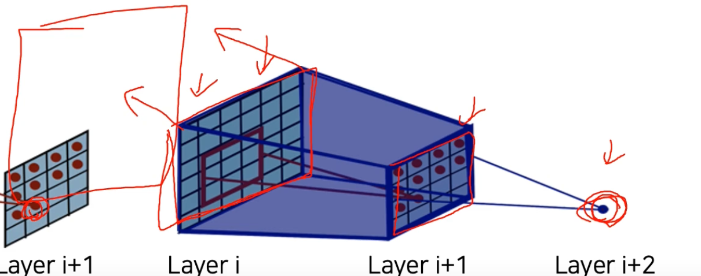

## (1강) Image Classification 1

---

- 영상인식
- computer vision 이란?
- 영상인식이란?
- 왜 CNN이 그렇게 중요한지?

### 1. Course overview

- 1.1 Why is visual perception important?
- 1.2 What is computer vision?
- 1.3 What you will learn in this course

### 2. Image classification

- 2.1 What is classification?
- 2.2 An ideal approach for image recognition
- 2.3 Convolutional Neural Networks (CNN)

### 3. CNN architectures for image classification 1

- 3.1 History
- 3.2 AlexNet
- 3.3 VGGNet

---

### 왜 CV가 AI로 분류되는가?

- AI: 사람의 지능을 컴퓨터 시스템으로 구현하는 것

- 인지, 지각, 기억, 이해, 사고능력 등을 포함
- 인공지능의 레퍼런스: 인간
- 사람이 세상을 배우는 방법
- 오감
- 세상과 interaction하는 방법을 배움
- 오감을 활용한 지각능력을 먼저 발달시켜, 세상과 상호작용하고, 이때 얻어진 관찰들을 가지고 인과관계를 통해 사고를 ㄹ높임
- 지각능력의 획득이 제일 중요

- 지각능력이 제공하는 것: 입력과 출력
- 인공지능은 사람이 사용하기 위한 것이므로, 사람이 이해할 수 있는 입출력에 관련되는 것이 좋음
- 멀티모달 감각을 통해 더 유용한 정보를 얻을 수 있음
- 얼굴 말고 촉감, 표정
- 제스쳐 ..
- 아직 우리도 우리가 어떻게 정보를 받아들이는지 잘 모르므로, 연구중인 주제
- perception 지각 능력이 가장 기본이 되어야함

- 사람
  - 눈으로 보고 수정체 뒤에 상이 맺히는 것: sensing
  - 뇌에 자극을 전달하고 이해하려고 함, 뇌에서는 해석을 하게 됨
- 기계
  - 장면에 대한 분석
  - 깔끔한 자료구조로 출력
  - 컴퓨터가 다루기 쉬우면서도, 사람도 해석가능한 표현형태 = representation
  - 이 정보를 재구성하는 것을 computer graphics
  - 2D로 다시 그려내는 것을 rendering

- 컴퓨터 비전은, 구현 뿐만아니라, 사람의 시각능력에 대한 이해를 바탕으로 한, CV 알고리즘의 연구도 포함
- 사람의 biological 한 면을 이해, 이를 CV 알고리즘으로 구현할지 도 포함한다는 것

- 사람의 시각능력
  - 치명적 불안정성있을 수 있음
  - ex) 눈과 시각을 담당하는 뇌부분 학습 시, 똑바른 상태만 많이 봐서 시각기능이 bias되어 학습되어있음
    
  - 사람의 시각에 대한 장단점 이해를 함으로서, 이런 치명성을 보완할 수 있음
  - 고전 ML
    
    - 전문가가 feature extraction(노이즈, 특징 분리, ..) 방법론 설계
    - feature: 어떤 특징이 데이터를 잘 특정하겠다
    - 간단한 모델을 통해 target task 해결
- 딥러닝
    
  - 전문가가 특징 추출하지 않고, end to end 처음부터 끝까지
  - 사람은 선입견을 가지고 있을 수 있음
  - 사람이 특징을 간과하기 쉽고, 특징을 어떻게 표현하는지에 대해서도 성능이 달라짐
  - 사람이 일일히 특징추출법 찾는 것을 gradient descent가 대신했고, GD가 사람보다 더 나음

- 배울 것:
  - 멀티모달? 다른 감각 데이터들과의 융합
  - 생성모델의 control 가능한 버전: Conditional generative model
  - Neural network analysis by visualization 툴

---

Classifier(분류기): 어떤 물체가 영상 속에 들어있는지 mapping

- input: 영상
- output: 영상이 해당하는 카테고리, 클래스

39만약 모든 데이터를 다 가지고 있으면, 다 분리할 수 있음

40

가장 비슷한 물체를 찾을 수 있으면, 어떤 카테고리인지알 수 있음

KNN 문제로 생각할 수 있음

- 질의데이터가 들어오면 주변 K개의 데이터를 확인해서, 해당 데이터의 레이블들을 확인해서

KNN 알고리즘을 기반으로, 모든 데이터들을 다 가지고 있다고 하면, 영상분류문제가 검색문제로 바뀌고, 다 잘 풀 수 있을 것

- 그러나 가지는 데이터 수 만큼, 연산량과 메모리 용량이 비례해서 증가하게 됨
- 아무리 커도 세상의 모든 데이터를 다 담을 수 없음
- 아 그리고  사실은, 영상간의 유사도를 정의해야함!
- 일단, 데이터 너무 많으면, 시스템 복잡도가 너무 올라가서 실현 불가
- 우리가 공부하는 NN 모델은, 결국 방대한 데이터를 압축해서 녹여내는 것!

## 가장 간단한 모델: 영상분류를 위한 single layer NN (FC layer)

- 모든 픽셀들을 서로 다른 가중치로 weighted sum(내적)하고, 비선형함수를 통해 분류 스코어로 출력하는 간단한 문제
- 영상 분류에서의 문제가 있음 → weight도 reshape
- FC는 결국 입력 영상과 동일한 크기의 템플릿으로 볼 수 있고, 이 템블릿과 내적을 통한 비교로서, 스코어를 출력할 수 있음
- 근데 이 템플릿도 visualize 가능 → 클래스마다 평균적인 이미지로 보이게 됨
  - 정보를 포함하는 것을 눈으로 볼 수 있음
  - 근데 문제 두개
      1. 레이어가 1층이라 너무 단순해서, 평균 이미지 같은 것 이외에는 표현이 안됨
      2. 적용시점, test time에서의 문제
          - FC 레이어가 템플릿을 얻는데, 만약 test할 때, 물체의 일부만 입력으로 주어지면, 분류 불가능
          - 템플릿의 위치나 scale이 조금이라도 안맞으면 굉장히 다른 결과/해석을 준다.
  - 이 문제 때문에 CNN이 등장

## locally connected neural networks

- 하나의 특징을 뽑기 위해서 모든 픽셀을 고려한는 FC layer 대신,
- 영상의 공간적인 특성을 이용해서 국부적인 영역들간의 커넥션을 고려한 것
- 특징만을 뽑는 것을 고려하면, 파라미터가 획기적으로 줄어듦
- weight 파라미터가, 픽셀 바이 픽셀로 웨이트를 유지할 필요가 없음
- 이런 지역적인 특징들이 영상 한군데에서 발현되는 것이 아닌, 영상 여러 곳에서 발현 가능
  - ex) 정면이 아닌, 치우치게 나온 이미지라면
  - 그래서, 이를 슬라이딩 윈도우처럼, 커넥션을 공유를 해서, 전영역을 순회하며 feature를 뽑는 것이 CNN
  - 필터를 모든 픽셀에 동일하게 적용(바로 옆에도 동일하게 적용)
  - 히든 노드의 activation들을 잔뜩 뽑음(feature map 형태로)
  - 파라미터 재활용 가능 - 영상 전체에 대해서
  - 적은 파라미터로도 효과적인 특징 추출가능 → 오버피팅 방지 가능
- 슬라이딩 윈도우 방식: 영상에서 개체의 위치가 좀 바뀌더라도, 특징이 제대로 뽑힐 것
  - 위치에 민감하지 않게 만들 수 있음
- CNN은 그래서 다양한 CV 태스크의 기본적인 백본 네트워크(base network)로 사용
- 영상의 특징을 추출하는 백본네트워크 위에, 타겟 태스크의 헤드를 적합하게 디자인해서 사용하는 형태가 기본적인 CV에서의 알고리즘의 디자인 패턴!
- image-level classification: image recognition
- imgage classification+regression: obj det
- .. .segmentation

- 이 강의에서는 영상인식 모델에 대해서 살펴보자

# CNN 구조를 이용한 image classification의 발전사

## Alexnet

- yann LeCun의 CNN 발명
  - 이때: 컨볼루션 레이어 2개, FC 레이어 2개 로 이루어진 간단한 구조
  - 한글자 단위 인식
  - 우편번호 인식에 크게 성공하여, 우편 운송에 기여
- Alexnet은 이 구조에서 많은 motivation을 따왔음
  - 대표적으로 다른 부분
    - 더 많은 레이어, 더 많은 파라미터
    - 학습데 엄청난 데이터 사용
    - 중간에 렐루라는 non-linear activation func
  - 네트워크 구조
    

    - 각 레이어별로, activation map의 사이즈를 표현한 다이어그램
    - 네트워크 패스가 두개로 나뉨
    - 왜 ?
      - 지금은 알렉스넷이 작다고 생각할 수 있지만, 이는 GPU의 발전 덕분(GPU 메모리 커져서)
      - 이때는 GPU 메모리가 부족해서 네트워크를 절반으로 나눠서 각각의 GPU에 올렸음
      - 가끔 크로스함 → 이때 모든 GPU 두개 간의 모든 부분에서 cross comunication이 일어나면 연산량 투머치라서 줄인거
      - 48 dim 중요
      - 

- 2 stream을 단일 stream으로 만든 아키텍쳐

- LRN(normalization layer)는 뻈음
- conv, relu, max pool의 반복..
- max pooling된 2D activation map이 linear layer로 가기 위해서는, 바로 못가고, 특별한 작업 필요
  - 텐서 형태의 output을 (공간정보, 채널정보)
  - linear matrix로 바꿔줘야함(matrix operation)
  - so, 3D → 2D/1D
  - 텐서를 벡터로 만들어줘야함
  - 벡터화에는 두가지 옵션이 있음
    - average pooling: 공간정보를 다 압축시켜서, 긴 채널축의 정보만 남긴 벡터
    - flatten: activation map을 어떤 순서에 따라서 나열, 그냥 벡터 형태로 쌓게 됨
      - dim 차이가 있겠다
      - 알렉스넷에서는 두번째가 사용
      - (2 stream)48이었는데 (1stream)4096이 되었음 → 논문보면서 주의

<지금은 잘 사용되지 않는 것들>

### LRN (normalization layer)

- 지금은 사용하지않음(deprecated됨)
- activation map에서 명암을 normalization하는 역할을 함\
- 요즘은 Batch normalization사용

### 큰 컨볼루션 필터 사이즈

- 이때, receptive field size를 쉽게 크게 만들기 위해서 큰 커버리지를 가지는 11*11 사용했는데,
- 요즘은 이렇게 크게 안씀
- receptive filter size
- 연산 결과로 하나의 element가 나올때, 이 elem이 나오게 만들어준, 의존성이 있는 입력픽셀의 영역

- 여기서 본다면, 우측 하나의 elem을 결정하기 위해서 3*3 영역이 이 값을 결정했음(3*3 conv 사용했다고 했을 때) → 의존성이 있다고 볼 수 있음
- 그리고 여기서 input space에서의 영역을 receptive field라고 함

- 여러 레이어를 거치면서, 실제로 하나의 activation이 나오게 하기 위해서 참고하는 영역은 점점 커질 것
  - 값 하나를 위해서 많은 영역을 고려했다
- input space 에서의 영역을 봐야하므로 가장 밑 레이어까지 쭉 내린다고 생각

- 결국, 하나의 값이 결정되기까지 어느정도 영역을 참조했는가 = recep`~~ field
- recep field 결정하는 식
- K: 커널사이즈
- P: 풀링레이어 사이즈

### VGG

- 큰 특징: 깊다
- 알렉스넷보다 깊음
- 더 간단한 구조
  - 그러나 no local response
  - 3*3 conv, 2*2 max pooling만 사용
- 간단한 구조에 비해, 좋은 성능
- 미리 학습된 중간 특징을 다른 태스크에 적용할 수 있을 정도로, 일반화된 특징을 뽑기 시작함
- 정리
  - 더 깊지만, 심플하므로, 더 높은 성능과 일반화를 보여줌
  - 알렉스넷을 최대한 유지하려함
    - 그래서 입력 양식도 같음 224*224*(RGB 3 채널)
    - 입력 넣을때, 알렉스넷과 같이, training data의 평균 RGB값을 각 채널에서 빼줘서 넣음 → 약간의 normalization
  - 3*3, 2*2 가 큰 특징
    - 작은 커널 사이즈만 사용하는 것이 가능한 이유: 작은 conv도, 스택을 많이 쌓으면, 큰 receptive field size를 얻을 수 있음
    - 큰 receptive field size를 얻을 수 있음 = 이미지의 많은 부분을 고려하여 결과를 도출
    - 더 적은 파라미터, 더 깊은 복잡한 non linearity를 학습가능
      - → 복잡한 함수관계를 학습가능!
  - 마지막: 75페이지 나온대로!