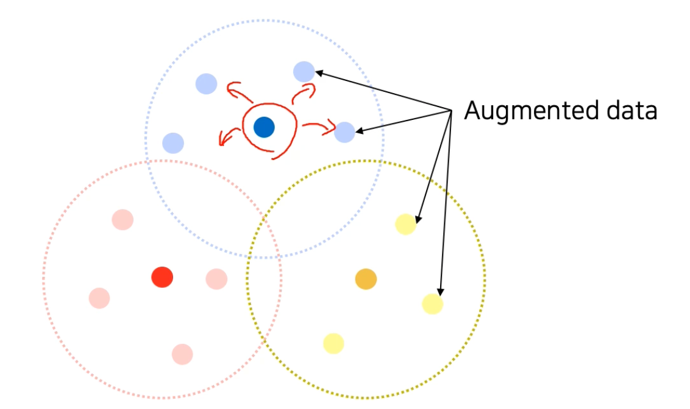

## (2강) Annotation data efficient learning

---

딥러닝에서 데이터는 많을수록 좋음

(레이블된) 거대 데이터셋을 구축하기는 쉽지 않음

따라서 annotation data(레이블 된 학습 데이터)를 효율적인 학습기법도 중요한 연구분야

시뮬레이션 데이터 합성, 도메인 adaptation, self supervised learning...

오늘) CV 문제에서, 이런 데이터 부족문제를 어떻게하면 완화시킬 수 있는지, 간단하지만 대표적인 테크닉

1. data augmentation
2. 다른 데이터셋에서 학습된 모델을 새로운 task(우리가 풀고자하는 task)에서 활용을 잘해서 데이터 아낄 수 있는 방법
3. unlabeled data을 활용하여 성능 높이는 방법

### Data augmentation

- 결국 NN은 데이터를 어떤 컴퓨터로만 이해할 수 있ㄴㄴ 지식으로 압축하는 모델이라고 볼 수 있음
- 데이터를 통해서 패턴을 분석하므로, 모델이 데이터를 골고루, 편식하지않고 머금고 잇다면 가장 좋을 것
- 그러나 실제 세상의 데이터는 모두 bias 되어있음
- p5) 어떤 데이터셋에 들어있는 각 클래스의 평균 이미지를 구한 것
  - 패턴이 선명하게 묻은 것을 볼 수 있음
  - 이 영상은 사람이 찍은 것! 예쁘게, 트렌드에 따라, 사진학의 황금비율등, ... 정해진 패턴이 있어서, 그것에 맞게 찍게 됨. 이들은 우리가 보기좋게 찍기 위해서 bias 하게 찍게 되었다고 볼 수있음
  - 데이터 자체에 bias가 있다.
  - training data는 사람이 찍었기 떄문에 real data(test time에서 뭐가 들어올 지 모르는 데이터)와는 다름

- 학습에 사용되는 데이터는 샘플링된 데이터라고 볼 수 있음
- 일정 영역의 실제 발생 가능한 데이터는 우측과 같이 밀도있게 나오지만, 우리가 취득할 수 있는 데이터는 일부일 뿐
- 우리는 빈 공간의 데이터를 볼 수 없고, bias까지 되어있음
- 문제가 되는 이유?
  - 낮에만 찍은 데이터만 학습시키고, 밤에 찍은 데이터로 테스트하면 헷갈림
  - 데이터셋이 real dataset을 충분히 표현하지 못했기 떄문에 발생한 문제
  - 이런 sample data와 real data의 gap을 어떻게 해야 메꿀 수 있을까?
  - 더 많은 데이터를 bias하지 않게 찍으면 좋긴함
  - 그러나 이를 못하니까 이 공백을 채우고, 풍부하게 만들어주는 노력이 augmentation

    

- 결국, 학습데이터에 들어있는 데이터를, 기본적인 operation을 통해서 여러장으로 불리는 것
- 이러한 hold들을 채워나가는 것
- 이 세상에서 찍을 수 있는 가능성을 조금더 높여놓는 것
- 실제 데이터와 생성된 데이터 사이의 간격을 조금 더 좁힐 수 있는 방향으로
- 다음과 같은 영상처리 테크닉이 사용됨
  - 기하, 컬러, 명암 밝기의 변화, ...
  - 이들은 openCV, numpy 라이브러리에 사용되기 쉽게 구현되어있음
  - 미처 포함되지 않은 데이터셋을 포함하게 해줄 수 있게 함

- 영상의 밝기
  - 밝게 찍히기도하고, 어둡게 찍히기도 하므로, 이 경우에도 고려해줘야함
  - 숫자는 Random sampling해서 더해줘도됨
  - 대신 0~255의 값을 가질 떄, 255 size를 넘지 않게 clipping 해줘야함

    

    - 배수 형태로 밝기 조절도 가능

  - 회전과 반전
    - flip(numpy에 존재)
    - opencv.rotate

  - crop: 간단하면서도 의외로 강력
    - 주요 부분에대해 더 강력히 학습 가능
    - 간단히 numpy arr에서 인덱싱을 통해서 사용가능

  - affine transform, perspective transform(더 복잡) 등 도 있음
  - affine transform (= shear transform)
    - 선은 선으로 유지되고, 길이의 비율과 두ㅜ개 사이의 비율은 유지되어야함
    - 평행관계가 유지

    

  - 2*2 행렬과, traslation param 2개 필요, → 총 6개의 변환 행렬 값들이 필요
  - 근데 행렬값 하나하나 손으로 넣어주기 어려우니까, 대응하는 점 3개(입력영상의 점 3개)를 잡아서, 출력영상의 점 3개 대응 쌍을 주게 됨

    

  - 함수에 위의 대응쌍 3쌍을 넣게되면, 6개의 변환 행렬값이 차있는 행렬이 반환이 될 것
  - 맨 마지막은 001로 맞춘 변환행렬이 나오게 될 것
  - wrapAffine:  이미지를 변환시킴
    - 기하학적으로 이미지를 비틀거나, 회전하거나, 픽셀의 위치를 옮겨주는 것을 warping이라고 함
    - 그래서 함수명이 warp이라고 시작
    - 영상의 픽셀 위치를 옮겨주는구나~

  - 두 영상을 잘라서 합성
  - 합성시켜서 증강

    

    - 만약 강아지 종류가 다르면, 영상만 잘라서 합성하는것이 아닌, 라벨도 합성해주는 것이 키포인트!
    - 이거 간단해보이지만, 이 방법을 사용하면, 손쉽게, 의미있는 수준의 성능향상!
    - 동시에, 물체의 위치를 더 정교하게 캐치할 수 있다고 함
    - 비율로 섞여있다는 정보를 간접적으로 주기도 하고, 0.3를 찾으려면 어디를 학습해야하지? 라는 것을 반복학습을 통해서 배우게 됨

    - 어떻게하면 더 다양한 방법을 만들 수 있을까?
      - 조합!
      - 여러 가능한 영상처리 기법을 조합하여 전혀 다른 데이터 생성가능
      - 어떤 조합이 더 좋은 성능?
      - 조합의 순서는?
      - 이러한 디자인 초이스들이 많이 발생
      - 이런 어려운 결정문제를 쉽게 답변: rand augmention
      - 모든 가능성을 탐색할 수 없으니, 랜덤하게 augmentation기법을 샘플링하여 수행해보고, 성능이 잘 나오는 것을 가져다 사용하자!
        - augmentation police를 자동으로 search
        - 어떤 aug, 얼마나 세게? 이 두개가 파라미터가 됨
        - 파라미터를 랜덤 샘플링하고, 이 파라미터들을 조합해서 연속 시퀀스를 만들어서, data augment기법을 만들게 됨
        - 하나의 augmentation기법들의 seq를 policy라고 부름
          - 이걸 random sampling하는 것
          - N개의 aug seq를 random sampling함
          - 파라미터는 두개(어떤 augmentation, 얼마나 세게)... so, 2 * N만큼의 샘플링을 하게 됨
          - 샘플링된 policy를 통해서 모델을 학습시키고, 성능을 평가, 이를 통해 효과적인 data augmentation기법을 찾아내는 것
          - 결과: 대부분의 결과에서 손쉽게 결과 improved
          - 쉽게 성능향상시킬 수 있는 것이 data augmentation

---

## Leveraging pre-trained information

- 데이터를 적게쓰고도 좋은 성능을 발휘하기 위해서  (다른 데이터셋에서 학습된) pre-trained 정보를 어떻게 활용할지
- 새로운 동작하는 인공지능을 만들어야할 때, 데이터셋 먼저 모으겠지!
- 입력데이터(with 레이블) 필요 → 인건비
- 이런 데이터를 단기간에 대규모로 얻기가 힘들 것

- 근데 아웃소싱같이 외주 맡기면, 왼쪽을 만들어달라고하면 오른쪽을 얻을수밖에... 이를 고퀄로 유지하는 방안도 필요
- 비용을 줄이기 위한 방법: Transfer learning

### Transfer Learning

- 기존에 미리 학습해놓은 사전지식을 활용해서, 연관된 새로운 태스크에, 적은 노력으로도, 높은 성능을 도달가능한 기술
- 쉽고 경제적, 어느정도의 성능 보장
- 한 데이터셋에서 배운 지식을 다른 데이터셋에서 활용
- 다른 데이터셋들 간에는 영상이라는 공통점이 있음...
  - 일부 패턴은 다른 영상에서도 비슷하게 나타남
  - ex) 동물들의 텍스쳐, 잔디, 풀, 바퀴, ...
  - 한 데이터셋에서 배운 지식 중에서 다른 데이터셋에 적용되는 공통되는 지식이 의외로 많지 않을까? 라는 가정이 transfer learning의 탄생배경
- 여러가지 방식이 있음

#### 1

하나의 데이터셋에 미리 학습한 모델을 준비

- 10개의 카테고리 분류를 위한 모델이 있으면, FC layer를 잘라냄
- 그 자리에 새로운 FC layer를 붙임 (100개의 데이터에 대한 분류를 위한)
  - 새로 학습!
  - conv layer는 fix 시키고, fc layer만 학습시키는 것
  - conv layer fix ⇒ 기존에 배운 것을 그대로 가지고 있을 것
  - fc layer는 적은 데이터로부터도 잘 학습되도록 가능
    - 몸통말고 머리만 학습
    - 몸통으로 부터 온 feature들을 잘 활용해서 새로운 태스크에 대응하도록 학습
    - 학습해
    - 야할 파라미터가 줄었기 떄문에 적은 양의 데이터셋에 대해서도 잘 동작
- 데이터가 겁나 없을 때

#### 2

- 미리 학습된  모델에서, FC layer를 잘라냄, 새로운 FC layer로 대체
- 마지막 새 layer만 학습하는것이 아닌, 낮은 learning rate를 가지는 conv layer 학습도 이뤄짐
- 대신 fc layer의 lr이 더 높게 잡아서 더 빠르게 학습되도록 함
- 첫 방식에 비해서 더 많은 데이터 필요, 그러나 더 좋은 성능 얻을 수 있음
- 데이터가 좀 더 있을 때, 더 좋은 성능의 fine tuning 가능

### Knowledge distillation

- pre-trained 모델이 가지는 지식을 이용하는 더 진보된 방법
- 간단하면서 강력
- = Teacher-Student Learning
- 이미 학습된 teacher network의 지식을 주로, 더 작은 student network에 주입하여 학습하는 데에 많이 사용되었음
- 큰 모델에서 작은 모델로 지식을 전달함으로서, 모델압축에 유용하게 사용
- 최근, teacher에서 생성된 출력을, un-labeled data의 pseudo label(가짜 레이블)로 자동 생성하는 매커니즘 사용
  - 이는 더 큰 student network를 사용할때에도 regularization역할을 함❓
  - 더 많은 데이터를 사용할 수 있게 되므로

- Standard한 knowledge distillation은 위와 같이 pre-trained model을 feature model로 준비하고, 아직 학습되지 않은 네트워크를 initialize
- 이때, student는 작은 것을 사용하는 것이 일반적(모델압축처럼)
- 같은 입력에 대해서 동시에 feeding해서, 출력을 만들게 함
- 이 둘의 차이를 KL divergence loss를 통해 측정하여 역전파를 통해 student만 학습
  - KL divergence는 teacher과 student의 출력의 distribution을 비슷하게 만들도록 함
  - student가 teacher를 따라하게 함
  - 이 과정 중, label을 전혀 사용하지 않았으므로, unsupervised learning이라고 할 수 있음
  - 또한 데이터도, teacher model을 학습할 떄 썼던 데이터를 그대로 사용할 필요가 없음
    - 임의의 데이터 inputX 사용 가능

- 만약 레이블이 존재하는 데이터를 가지고 있을 때, 어떻게  knowledge distillation?

    

  - 레이블이 있는 데이터가 존재하므로, true label을 통해서 loss 측정가능
  - 이때, ground truth를 사용한 loss를 student loss라고 함
  - 이전에 배운, teacher를 따라가게 만드는 loss를 distillation loss라고 함
    
    - distillation 할떄에는 soft prediction 사용
    - soft prediction: quantize되지 않은 실수를 가질 수 있는 값
    
    - 일반적인 영상인식 모델을 학습할 때, 정답레이블은 N개의 클래스 중 하나임을 표시할 때, 원핫벡터를 통해서 나타냄 → hard label
    - soft label → 0, 1이 아닌, 사이값이 존재. soft max를 통해 나온 결과는 우측같은 실수가 나오게 됨
    - distillation에서는 각각의 값들의 전반적인 경향성이 knowledge를 나타낸다고 가정을 하고, 하나의 모델이 입력을보고, 어떤 생각을 하고있는지 요런 soft pre
    
    - soft prediction은 softmax를 통해서 나오게 됨
    - temperature (T)의 개념?
      - softmax: 모델에서 나온 출력을 통해서 soft prediction을 만드는 역할
      - softmax 값을 취하면, 입력의 값을 극단적으로 벌려준다.
      - 이떄 T를 넣어주면, 입력값을 큰 값으로 나눠서 넣어주면, 출력을 smooth하게, 중간으로 만들어줌
        - 즉 0, 1보다는 전체 softmax의 크고 작음들이 지식을 표현하는데에 더 유용하다고 보는 것
        - 극단적으로 0, 1만 있는 것보다는, 0~1사이의 중간값을 가지면서, 입력에 따라 민감하게 신호가 바뀌게 만들어서, student가 teacher를 더 잘 따라하도록 하는 것

    

    - 좌: 거의 0 근처에는 정보가 없고, 어디에 peak가 있다는 정보만 가질 뿐
    - 우: 중간에 몰려있으면, 어느것이 큰지, 작은지, 전반적인 분포를 알 수 있으므로, 더 많은 정보를 가지고 있을 것이라 생각할 수 있음

    

    - "semantic inform은 고려하지 않는다"는 것은 무슨 의미일까?
      - teacher에서 나온 output의 각각 dim이, pretrain할 떄 사용되었던 어떠한, 이전 task class들과 연관이 되어있음(위 빨간네모)
      - (아래 빨간 동그라미)student loss로 학습하는 이 데이터는, pre training dataset과 전혀 다른 태스크일 수 있음(label 정보가 겹치지 않는다던지, 카테고리가 겹치지 않는다던지)
      - 중복되는 정보가 없더라도, soft label에 발생하는 하나하나 dim들의 각각의 의미가 중요하다기보다는, 전체의 개형이 추상적인 지식의 형태를 표현하고 있어서, 행동 자체를 따라하도록 만드는 것이 중요하지, 내부 각각의 semantic 의미가 중요하다는 것은 아니다. ❓

    

    - 둘 다 classification 문제에 대해서, cross entropy 계열의 loss를 사용하게 됨
    - student: hard label이 gt로 부터 주어지기 때문에 , 일반적인 Cross Entropy를 그대로 사용
      - student network가 출력을 한 것과 true 레이블이 일치하게 만들어서
      - 맞는 값을 찾게끔 함
    - Distillation Loss: loss → KL divergence  = 2개의 distribution이 있을 떄, 두개의 distribution의 차이를 재는, 거리를 재는 measure
      - 여기서, soft label, soft prediction은 모두 0~1 사이의 값을 가지고, sum to 1인 probability distribution으로 볼 수 있기 떄문에, KL divergence를 주로 사용하게 됨
      - teacher와 student의 prediction 결과의 차이를 measure
      - 이로서, student가 teacher를 따라하게 만드는 loss

- 결국, 레이블이 있는 데이터의 경우, distillation loss와 student loss를 둘다 사용하게 되는데
  - 둘의 weighted sum을 사용해서 학습(합쳐서 사용)
- 역전파의 경로는 다음과 같음

- 결국 student model만 학습

#### Unlabeled data 활용법

leveraging unlabeled dataset for training

- 한정된 supervised dataset이 주어졌을 떄, 만족할만한 성능을 도달하기 위한 방법 중, unlabeled dataset을 활용하는 방법을 보자.
- 이번에는 추가적인 labeling 없이, 성능을 올리는 방법에 대해서 살펴보기

### Semi-supervised Learning

- semi supervised learning은 unlabeled data를 목적성있게 잘 사용하는 벙법
- supervised: 레이블 필요
- → 대규모 데이터셋 구축하는 것에 한계가 있음
- unlabeled data를 사용한다고 하면, web scale의 무궁무진한 데이터를 사용할 수 있을 것
- 많은 수의 unlabeled data와 적은 수의 labeled data를 동시에 활용하는 방법
- un-supervised + supervised 방법을 합친 학습방법이라고 볼 수 있음

- 아까 knowledge distillation이 pseudo label을 생성해서, 활용할수도 있다고 했는데, 이 예제가 그거!
- 방법

- 레이블 데이터로 모델을 먼저 pre-train(label 된 small scale의 데이터셋)
- unlabeled의 pseudo data를 이 모델을 통해서 가짜로 잔뜩 생성(자동으로 생성)
- 그러면 이제 pseudo dataset을 얻게 됨
- 그럼 아래의 두 데이터셋을(labeled dataset, pseudo-labeled dataset) 합쳐서, 새로운 모델을 다시 재학습

- 지금까지 data augmentation, knowledge distillataion, semi-supervised learning에 대해서 살펴봤다.
- 이 방법론들을 잘 결합하면, imagenet에서 새로운 지평을 연 새로운 연구를 만들어낼 수 있음
- 최신연구: self-training
  - 성능향상 괄목할만했지만, 성능 자체가 압도적
  - augmentation, teacher-student network, knowle d~ distill~, SSL을 합친 방식

    

- Self-training with noisy student 방법
  - SSL 방식과 유사
  - 일단 이미지넷 데이터셋을 통해서 teacher network를 학습시킨다
  - 그리고 수도 레이블을 teacher network로 생성한다
    - 300M unlebel 데이터를 전부 psueudo labeled dataset으로 만들어줌
  - 그래서 이 두 데이터셋을 합쳐서 student model을 학습
    - 이떄  rand augmentation을 사용해서 더 많은 양을 학습
  - 마지막 스텝: student 학습이 끝나면, teacher를 날리고, 직전에 학습한 student를 teacher 로서 사용함
    - 또 다시 re-label해서 pseudo labeled data 로 만듦
    - 또 새로운 student model을 학습...
    - 이를 반복

    

    - 이전에 distillation에서는 teacher가 더 크고, student가 더 작은 네트워크라고 했는데, 여기서는 그 반대로 사용을 한다.
    - student 모델이 조금씩 더 커짐..!

    

    - 방금전 cycle loop를 펼쳐서 보여주는 diagram
    - 모델이 대체되어가는 것을 명확히 보여줌
    - 이를 통해서 unsupervised datset과 supervised dataset을 잘 합쳐서, 기존의 unsupervised로서 넘지 못하는 마의 장벽까지도 넘은 그러한 연구로 볼 수 있음
