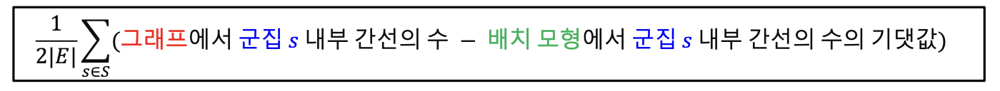
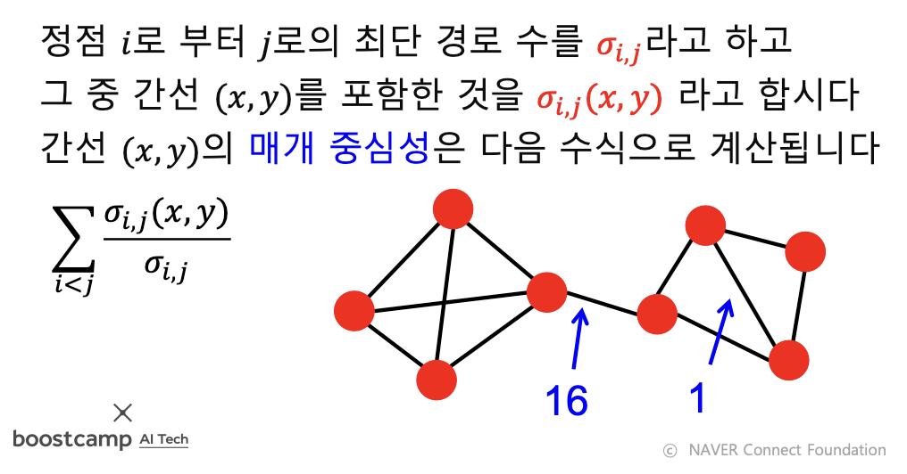
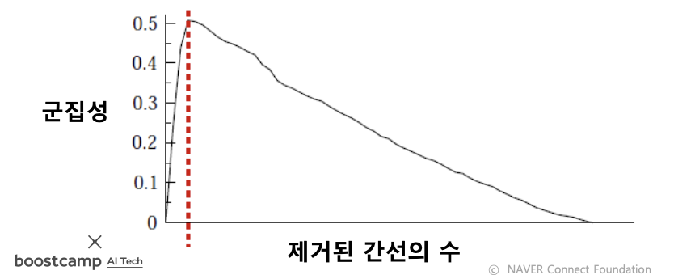
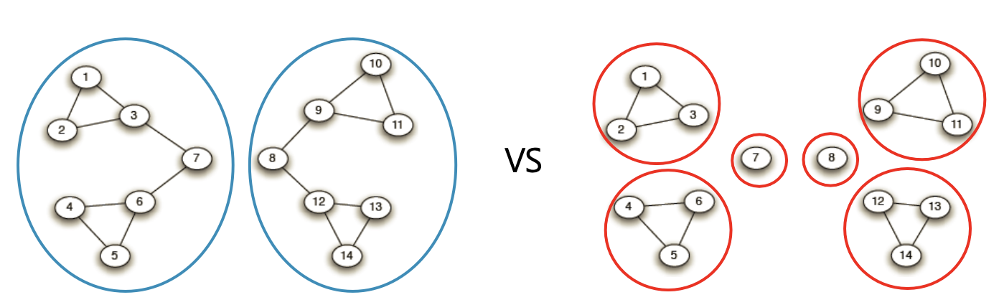
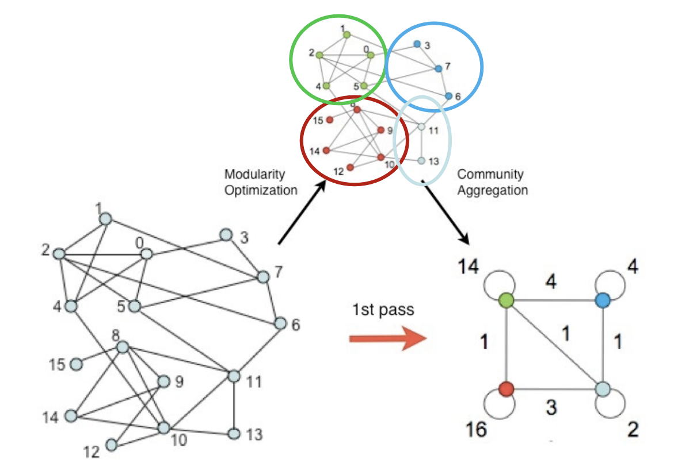
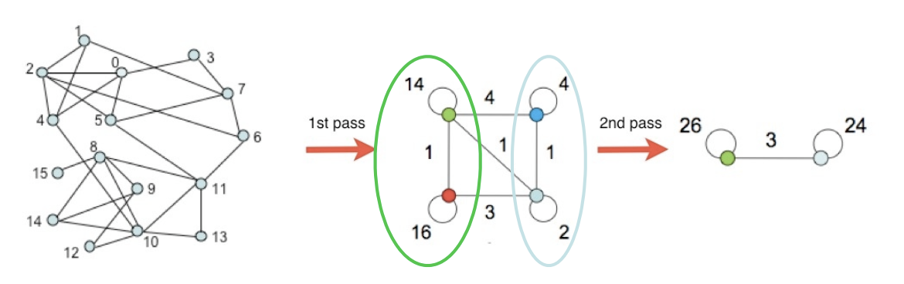
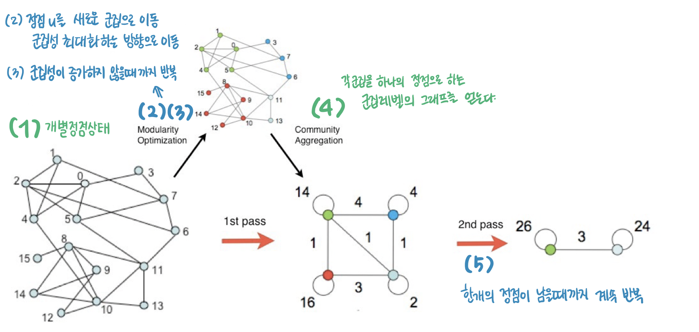
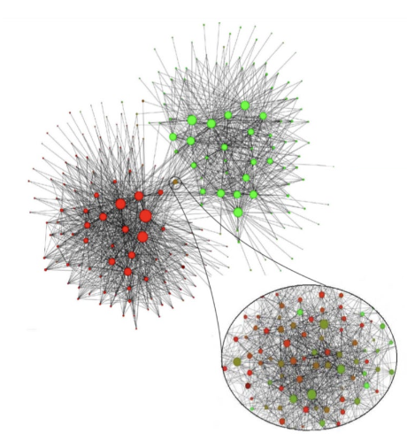

## **[DAY 23] 군집구조와 군집탐색**

---

### 군집구조와 군집탐색 문제

#### 군집(Community)

- 집합 내의 간선 수는 많고, 집합 밖의 간선의 수는 적은 경우
- 아래 조건들을 만족하는 정점들의 집합
  1. 집합에 속하는 정점 사이에는 많은 간선이 존재한다.
  2. 집합에 속하는 정점과 그렇지 않은 정점 사이에는 적은 수의 간선이 존재한다.

> ✏️ Day21 참고

#### 군집탐색(Community Detection) 문제

- 그래프를 여러 군집으로 ‘잘’ 나누는 문제
- 보통은 각 정점이 한 개의 군집에 속하도록 군집을 나눈다.
- 비지도 기계학습 문제인 클러스터링과 상당히 유사하다.
  - 군집탐색(Community Detection): 정점을 묶는 것
  - 클러스터링(Clustering): feature들의 벡터 형태로 표현된 인스턴스 그룹으로 묶는 것
    > 둘의 차이는?

> 성공적인 군집 탐색이란?  
> 비교대상: 배치모형  
> 성공적인 군집 탐색을 정의하기 위해서 배치모형이라는 비교 대상을 먼저 설정해야한다.

---

### 군집구조의 통계적 유의성과 군집성

#### 배치모형(Configuration Model)

- 주어진 그래프에 대한 배치 모형은 아래(조건)를 의미한다.
  1. 각 정점의 연결성(Degree)을 보존한 상태에서
  2. 간선들을 무작위로 재배치하여서 얻은 그래프
    > 각각의 정점에서 나가는 간선의 수만 유지하는, 무작위 그래프(모형)을 만들어준다.

- 배치 모형에서 (간선들을 무작위로 배치하기 때문에) 임의의 두 정점 𝑖와 𝑗 사이에 간선이 존재할 확률은 **두 정점의 연결성**에 비례한다.
    > ✏️ Day21 참고
    > 정점의 연결성(Degree)은 **그 정점과 연결된 간선의 수(해당 정점의 이웃들의 수)** 를 의미

#### 군집성(Modularity)

- 군집 탐색의 성공 여부를 판단하기 위해서 군집성 사용
- 군집성 측정 방법
  - 그래프와 군집들의 집합 S가 주어졌다고 하자,
  - 각 군집 𝑠 ∈ 𝑆 가 군집의 성질을 잘 만족하는 지를 살펴보기 위해,
  - <u>군집 내부의 간선의 수를 그래프와 배치 모형에서 비교한다.</u>
- **군집성 수식**
  - 
  - $|E|$ : 간선의 수
  - $1 \over {2|E|}$ : $-1 \sim 1$ 사이의 값으로 정규화하는 역할을 한다.
  - 그래프에서 군집 s 내부 간선의 수는 클수록 좋다.
  - 배치모형에서 군집 s 내부 간선의 수의 기댓값(→ 배치모형이 무작위성을 포함하기 때문)
  > 📌 즉, 배치모형과 비교했을 때, 그래프에서 군집 내부 간선의 수가  
  > 월등히 많을 수록 성공한 군집탐색이라고 할 수 있다.  
  > 전체 식의 결과를 보았을 때에도, 식의 차이가 클 수록 좋다.

- 군집성은 무작위로 연결된 배치 모형과의 비교를 통해 통계적 유의성을 판단한다.
- 군집성은 항상 $–1 \sim +1$ 사이의 값을 갖는다.
- 보통 군집성이 $0.3 \sim 0.7$ 정도의 값을 가질 때, 그래프에 존재하는 통계적으로 유의미한 군집들을 찾아냈다고 할 수 있다.

🔍 군집성 수식의 이해 (내 방식대로 이해해보기)

---

🔍 **군집성 수식의 이해**

각 정점들에서 나가는 엣지의 수를 고정하고, 모양을 랜덤하게 뽑는 것을 배치모형이라고 한다.  
배치모형을 뽑았을 때, "배치모형에서 군집 s 내부 간선의 수의 기댓값"이 뜻하는 것은,  
이걸로 다른 모형을 만들었을 때, 내가 정의한(내가 판단한) 집합 s가 실제로 이어질 확률 쯤으로 생각할 수 있다.  
그래프에서 내가 집합이라고 판단한 정점들 사이의 간선이, 랜덤하게 정점을 배치했을 때, 그 노드들이 얼마나 붙어있을지에 대한 확률보다 더 크다면, (내가 묶어준 집합은) 진짜 집합일 가능성이 크다는 것이다.  
이해하기 어렵다면, 그래프가 진짜고, 배치모형이 랜덤 그래프라고 생각해보자.  
<u>랜덤 그래프에서 그 그룹이 묶일 확률이 크지 않다고 하자. 근데 진짜 그래프에서 내가 묶어보니까 확률이 높다! "이렇게 붙어있을 애들이 아닌데 붙어있다" 쯤으로 해석하면 될거같다.</u>

---

### 군집 탐색 알고리즘

#### Girvan-Newman 알고리즘

> top-down  
> 큰 군집부터 시작해서 작은 군집으로 쪼개어 나간다.
> 군집간 다리 역할을 하는 간선을 자른다.
> = 매개 중심성이 높은 간선을 순차적으로 제거  

- 대표적인 **하향식(Top-Down) 군집 탐색 알고리즘**
  큰 군집부터 시작하여, 작은 군집으로 쪼개어나간다

- (추상적)과정
  - Girvan-Newman 알고리즘은 전체 그래프에서 탐색을 시작한다.
  - 군집들이 서로 분리되록, 간선을 순차적으로 제거
  - 이렇게 잘린 각 community들은 각각 연결요소가 된다.
- **Question: 어떤 간선을 제거해야 군집들이 분리될까?**
  - Answer: 서로 다른 군집을 연결하는 다리(Bridge) 역할의 간선!
- **Question: 서로 다른 군집을 연결하는 다리 역할의 간선을 찾아내는 방법?**
  - Answer: 간선의 매개 중심성이 높은 것이 다리 역할을 한다!
  - **간선의 매개 중심성**(Betweenness Centrality): 정점 간의 최단 경로에 놓이는 횟수
    
  - 식: 두 정점 사이의 최단경로가 여러개 있을 때에는, 그 최단경로 중에, 매개중심성을 측정하고 있는 간선을 포함하는 것의 비율을 계산해서 그것을 모든 순서쌍에 대해 더해주는 것
- Question: 간선을 어느 정도 제거하는 것이 가장 적합할까요?
  - Answer: 군집성
    - 앞서 정의한 군집성을 그 기준으로 삼는다.
    - 즉, 군집성이 최대가 되는 지점까지 간선을 제거한다.
    - 단, 현재의 연결 요소들을 군집으로 가정하되, 입력 그래프에서 군집성을 계산한다.
    

##### Girvan-Newman 알고리즘 동작 과정 (정리)

1. 전체 그래프에서 시작
2. 매개 중심성이 높은 순서로 간선을 제거하면서, 군집성을 변화를 기록
   a. 매개 중심성이 높은 간선을 순차적으로 제거
   b. 간선이 제거될 때마다, 매개 중심성을 다시 계산하여 갱신
   c. 간선이 모두 제거될 때까지 반복
3. 군집성이 가장 커지는 상황을 복원
4. 이때,서로 연결된 정점들, 즉 연결요소를 하나의 군집으로 간주

##### Girvan-Newman 알고리즘의 결과

- 간선의 제거 정도에 따라서 **다른 입도(Granularity)** 의 군집 구조가 나타난다.
 

간선이 모두 제거되면, 정점의 수 만큼의 연결요소가 만들어진다.

> 전체 그래프에서 시작해서 점점 작은 단위를 검색하는 하향식(Top-Down) 방법

#### Louvain 알고리즘

- 대표적인 상향식(Bottom-Up) 군집 탐색 알고리즘
- 개별 정점에서 시작해서 점점 큰 군집을 형성
- 각 정점이 하나의 군집을 형성한다고 가정하고 시작

- Question: 어떤 기준으로 군집을 합쳐야 할까?
  - Answer: 군집성!

##### Louvain 알고리즘의 동작 과정

1. Louvain 알고리즘은 개별 정점으로 구성된 크기 1의 군집들로부터 시작
2. 각 정점 𝑢를 기존 혹은 새로운 군집으로 이동
   - 이 때, 군집성이 최대화되도록 군집을 결정
3. 더 이상 군집성이 증가하지 않을 때까지 (2)를 반복
4. 각 군집을 하나의 정점으로하는 군집 레벨의 그래프를 얻은 뒤 (3)을 수행
5. 한 개의 정점이 남을 때까지 (4)를 반복합니다

> 🔍 Louvain 알고리즘의 결과  
>   
> 그래프의 정점들은 실제로는 여러 정점들로 구성된 군집이다.  
> 다리역할을 하는 부분(다리역할을 하는 군집으로도 표현가능)은 혼합된 정점의 분류를 보여준다.

---

### 중첩이 있는 군집 탐색