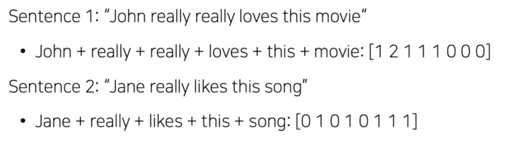

## **[DAY 16] BoW (Bag of Words)**

---

### Bag of Words의 정의

- 이름과 같이, 단어를 담는 가방과 같은 역할을 한다.
- 단어들의 순서는 전혀 고려하지 않고, 단어들의 출현 빈도에만 집중하는 텍스트 데이터의 수치화 표현 방법이다.

### BoW 만드는 과정

1. Vocabulary 생성하기
   - Vocab은 단어장 역할을 한다.
   - 중복된 단어를 제거하여 unique한 단어만을 모은다.
2. One-hot vector Encoding
   - 앞서 모은 unique한 단어들에게 고유한 자리를 지정하여 원핫벡터로 만들어준다.
   - BoW는 원핫벡터의 합으로 나타낼 수 있다.
   - ex)
    

---

### BoW의 특징

- 만약 8개의 단어로 이루어진 문장을 BoW로 만들면, 8차원(dimension)의 vector로서 하나의 단어를 표현할 수 있다.
- 각 단어들은 고유한 자리에 1을 가지고 나머지는 0의 값을 가지는 원핫벡터로 표현할 수 있다.
- 각 단어 쌍 사이의 (유클리디언) 거리는 $\sqrt{2}$
- 각 단어 쌍 사이의 코사인 유사도는 0이다.
- 📌 단어의 의미와는 관계없이, 모두 동일한 관계를 가진다. (값과 거리가 같음)
