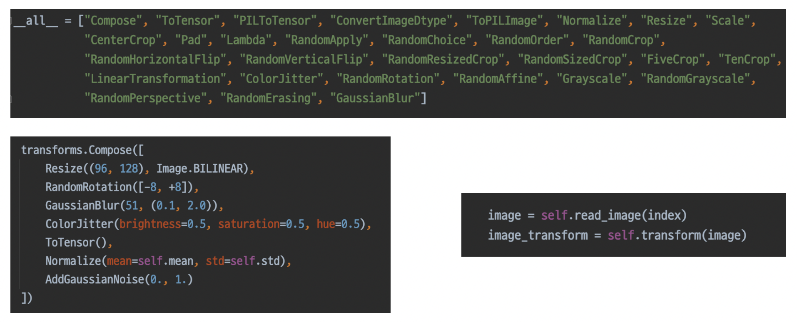
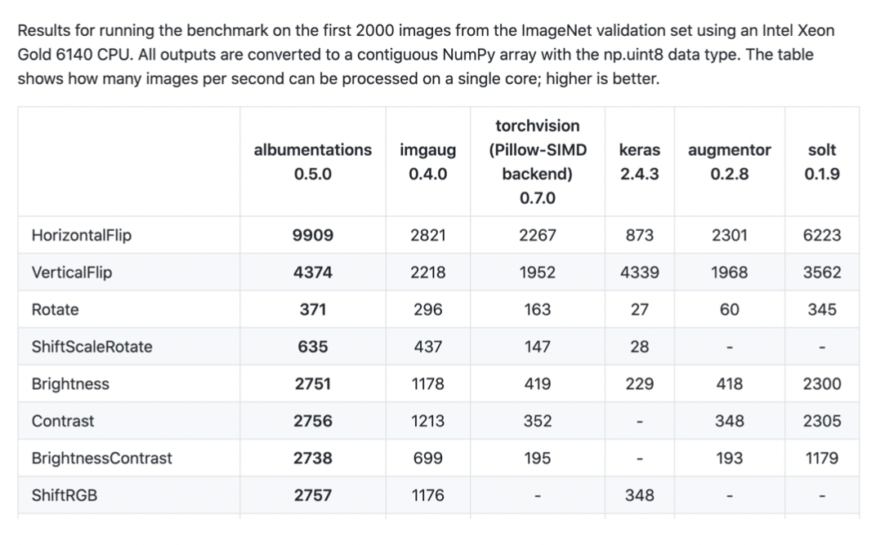
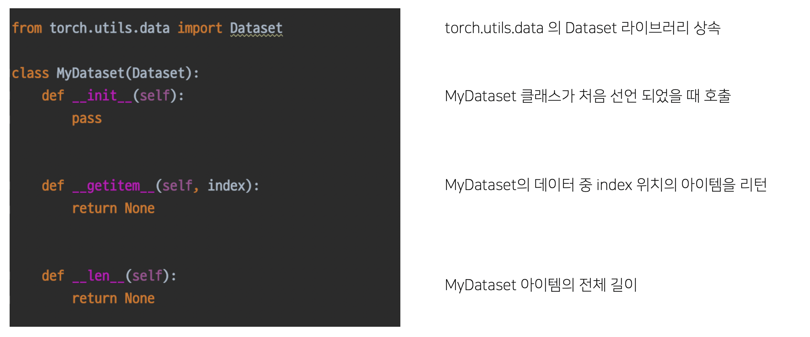
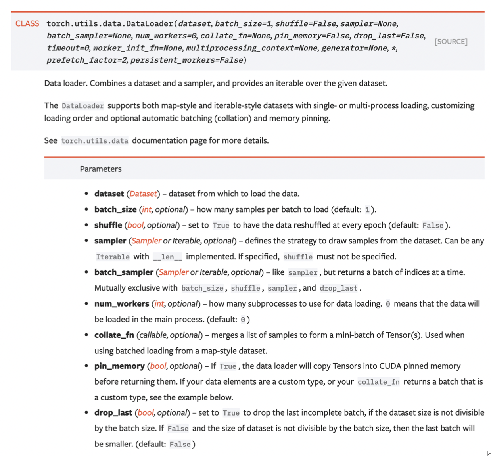
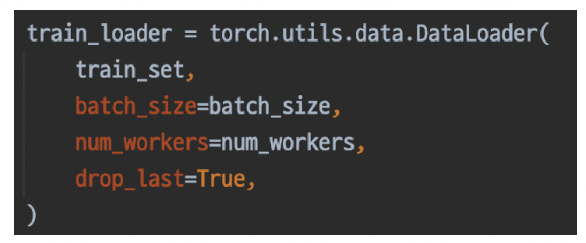
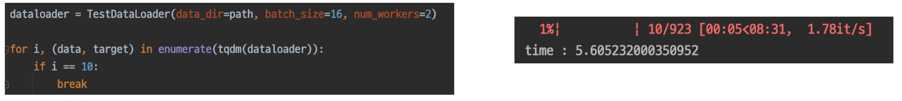

## **[P Stage 1 - 이미지 분류] Dataset & Data Generation**

---

## Dataset

- skill보다는 EDA의 목적이 중요
- data processing: 주어진 vanilla data를 모델이 좋아하는 형태의 dataset으로 만드는 것

### Pre-processing

- competition data: 잘 정제된 데이터
- 그러나 실제 현업 데이터는 정말 다양하고 스키마가 정해지지 않는 경우일 수도 있고, 이상치, 결측치(NULL)인 경우도 많음
- 데이터 용량 자체도 문제
- crop, rotate, 가우시안 노이즈와 같은 기법들을 실제로 적용하기 위해서는 도메인 지식이 필요
- 전처리는 마스터키가 아니다.
  - 해당 전처리의 당위성을 증명하기 위해서 가정, 실험, 증명 과정이 필요하다.
- 이미지 전처리는 도메인에 따라서 작업이 달라진다.

#### Bounding box

- 사진을 찍을 때, object만 정확하게 찍지 않음
- img의 메타 데이터들이 존재함
- 따라서, 바운딩 박스는 원하는 object를 명확히 표시할 수 있으며, 더 좋은 학습이 가능하게 한다.
- 박스 바깥 부분은 노이즈로 볼 수 있음

#### Resize

- 계산의 효율을 위해서 적당한 크기로 사이즈 변경
- 너무 큰 사이즈의 이미지는 과도한 계산량을 요구하며, 원본 이미지를 사용한다고해서 더 성능이 좋다는 보장이 없다.
- 파라미터의 수는 w, h에 의해 좌우되는 경우가 많다.
- 따라서 resize를 통해서 크기를 많이 줄이면, 계산량도 많이 줄어들게 될 것!

---

### Generaliztion

- 데이터셋 관점에서의 일반화

#### Bias & Variance

- High Bias(Under fitting): 데이터가 적은 경우, 충분히 학습하지 못해서 일부에 편향된 학습을 함
- High Variance: 많은 데이터(노이즈까지) 모델이 표현

#### Train/Validation

- 데이터셋으로 할 수 있는 일반화
- 훈련 셋 중 일정 부분을 따로 분리, 검증 셋으로 활용
- Dataset = Train set + Test set
- Train set = 실제 Train set + Validation set
- Validation set의 목적과 의미: 기학습했던 모델의 일반화 여부를 확인
  - 일반화 여부를 확인하는데 train set을 또 쓰게되면, 이미 학습한 데이터라서, 학습 제대로 되고 있는지 확인 불가능
  - 데이터가 적어지는데, 그래도 해야하는 이유: 학습이 제대로 되고 있는지, 일반화 되는지 확인

#### Data Augmentation

- 데이터를 일반화하는 과정
- 주어진 데이터가 가질 수 있는 Case(경우), Status(상태)의 다양성
- 예를들어, 배경, 쓰임새를 확인하면 도움이 된다
- 데이터가 나올 수 있는 과정과 환경을 생각하고, 사용 대상을 알면, 추후 노이즈를 생각할 수 있고, 임의로 노이즈를 만들어서 데이터를 생성해줄 수 있다.
- 노이즈 섞인채로 test 들어올 수 있는데, 이때에도 robust하게 대처할 수 있다
- 결국, 데이터의 ㅇ도메인에서 발생 가능한 노이즈 케이스를 고려할 수 있게 되는 것!

##### `torchvision.transforms`

- 이미지에 적용할 수 있는 다양한 함수들이 존재
- 도메인 지식에 기반한 방법을 적용해야한다.
- ex) 사진의 경우, 좌우반전은 가능하지만, 상하반전은 딱히 들어올 일 자체가 없으니 무의미
- 다양한 종류가 있고, 사용하기 간편함
- compose에 넣어서 한번에 util처럼 사용할 수 있음

##### `Albunentations`

- 패키지, pip 설치 가능
- transforms 보다 더 다양한 기능이 존재하며, 더 빠름
- 벤치마크
  

> 위와 같은 함수들은 도구일 뿐이므로, 완벽한 결과를 보장하지 않는다.  
> 앞서 정의한 주제(problem)을 깊이 관찰해서, 어떤 기법을 적용하면 이러한 다양성, 강점을 가질 수 있겠다 가정하고, 실험으로 증명해야한다.

---

> GPU 효율이 낮은 이유?  
> 작은 배치사이즈, 데이터 generate 할 수 있는 부분을 벤치마킹하지 않음 ...(?) 등의 이유가 있을 것

## Data Generation

### Data Feeding

- feed: 먹이를 주다 = 대상의 상태를 고려해서 적정한 양을 준다.
- 설계, 제작(데이터생성), 포장(모델)의 과정이 있다고 할 때, 어느 하나의 속도를 높인다고 해서 전반적인 속도가 반드시 향상되는 것은 아니다.
- 다른 요소의 고정적인 속도로 인하여 예상/원한느 속도가 안나올 수 있다.
- 그래서 Dataset 생성 능력을 비교해보는 과정도 필요하다.
  - 어떤 전처리를 하느냐에 따라 만드는 속도가 다르고, 각 처리 과정의 순서에 따른 속도도 다르다.
  - 예를들어, resize로 사이즈늘 늘리고, random rotate 하는 것과 그 반대의 순서는 속도 차이가 확연하다.

### `torch.util.data`

- 패키지

### Dataset

- Dataset: 원하는 형태로 데이터를 뿌려주기 위해서 변형되어야 한다.  
  
- 내 데이터를 pytorch 데이터셋 형태로 만드는 것
- Dataset 클래스에 상속시켜주어야 한다.
  - torch가 할 수 있는 기능 동작해야하므로, 행세를 하기 위해서 클래스에 상속되어져, 사용된다. 
- `__init__`
  - 데이터 위치, 절대경로같은 메타데이터
  - 저장 시에 주로 사용된다.
  - 객체를 선언하면 바로 실행된다.
- `__getitem__`
  - file을 읽어서 뱉어주는 역할
  - 데이터를 가져오는 역할
  - 데이터를 알아서 슬라이싱/인덱싱 해준다.
- `__len__`
- 이들이 없으면 오류가 난다. (반드시 선언되어야함)

> `__` 의 의미는 무엇일까? pythonic?

### DataLoader

- 내가 만든 dataset을 효율적으로 사용할 수 있도록 관련 기능을 추가하는 것
- 기능이 굉장히 많고, 어떤 것을 같이 조합하느냐에 따라 성능이 바뀐다.  
  
- ex) collate_fn: 배치마다(단위마다) 함수 정의 가능
- ex) num_workers: 스레드 수 (코어 수) 검증, 테스트 해보고 잘 조절해보기(그냥 무작정 스레드 늘려도 효율이 안좋다고 함)

  

   

- 이렇게 쓴다고 한다.

#### Dataset vs. DataLoader

- 서로 하는 일을 분리해서 정해주자!
- 재활용(재사용) 측면에서 중요!
- Dataset: Vailla data를 원하는 형태로 출력해주는 클래스
- DataLoader: Dataset을 더 효율적으로 사용하기 위함
  - util적 성격
  - 효율적으로 데이터를 뽑는 데에 사용된다.
  - dataset을 다른 것으로 교체해도 문제없다.
  - 데이터셋에 따라 계속 만들 필요 없고, dataloader는 재사용 가능하다.

